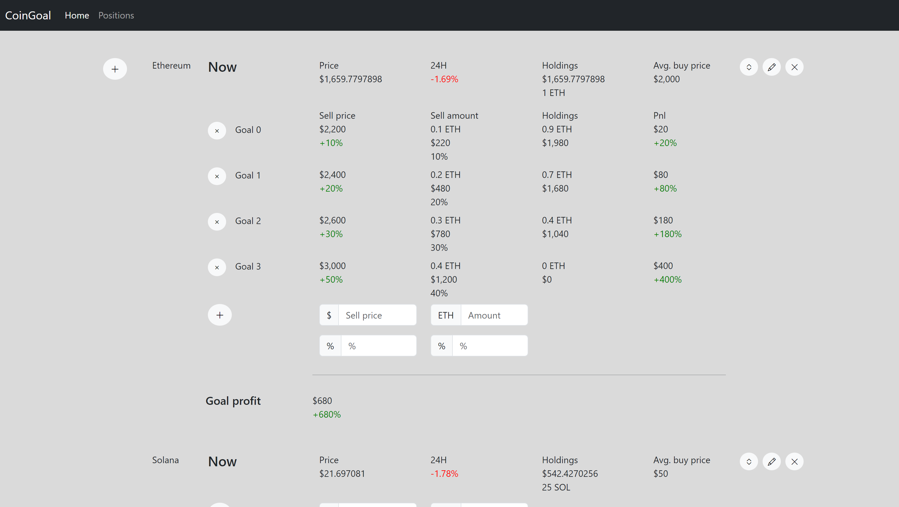

# CoinGoal

CoinGoal - это проект, созданный для отслеживания и управления финансовыми целями,
связанными с криптовалютами. Проект разработан с использованием современных
архитектурных подходов, таких как DDD (Domain-Driven Design) и Clean Architecture,
для обеспечения чистоты кода и модульности.

## Структура проекта

Проект CoinGoal имеет следующую структуру на основе архитектуры Clean Architecture:

- **core**: Этот слой содержит бизнес-логику и доменную модель. Здесь определены
  основные сущности, правила и сервисы, связанные с управлением финансовыми целями,
  связанными с криптовалютами.

- **application**: Слой приложения содержит реализацию бизнес-логики и сервисов,
  а также REST API с использованием Spring Web. Здесь обработка HTTP-запросов и вызовы
  бизнес-сервисов.

- **infrastructure**: Этот слой предоставляет реализацию инфраструктуры, включая
  взаимодействие с базой данных PostgreSQL с использованием Spring Data JPA. Здесь
  также могут быть реализации различных хранилищ данных или внешних сервисов.

- **presentation**: В этом слое находится фронтенд-приложение на Angular 15.
  Здесь пользователи могут взаимодействовать с системой через веб-интерфейс,
  просматривать и управлять своими финансовыми целями.

## Установка и запуск

1. cd .docker

2. docker compose up

3. http://localhost:4200

